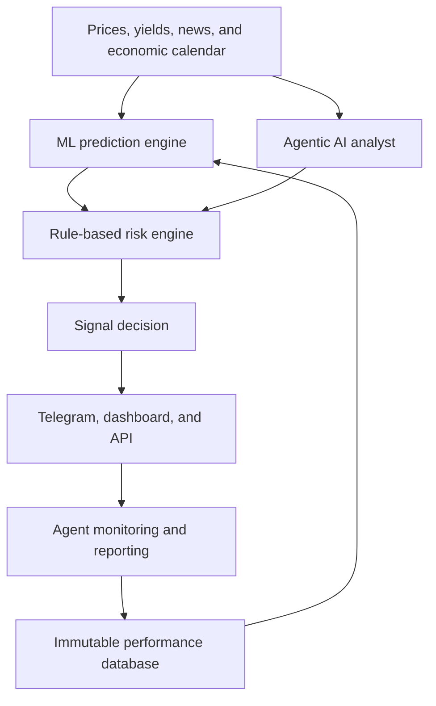

# Agentic AI Architecture for an AI-Assisted Gold Signal System

## Executive conclusion

A serious AI-assisted gold signal platform should not treat Claude, Codex, or another large language model as the price-prediction model itself.

The strongest architecture separates three forms of intelligence:

1. **Predictive machine learning** estimates whether a trade opportunity exists.
2. **Deterministic rules** enforce risk, execution, and operational constraints.
3. **Agentic AI** investigates context, validates inputs, explains decisions, monitors signals, and supports continuous system improvement.

The recommended design is therefore:

> **ML as the quantitative signal engine, deterministic rules as the risk engine, agentic AI as the analyst and orchestrator, and a human as the final governance layer.**

This remains an AI-led system. Human intervention is reserved for exceptional events, compliance, and model governance—not routine manual signal generation.

---

## 1. System architecture



| Component | Primary responsibility |
|---|---|
| XGBoost, LightGBM, LSTM, or ensemble | Statistical prediction and regime detection |
| Deterministic rule engine | Risk, execution, and safety constraints |
| Claude, Codex, or runtime LLM agent | Research, validation, explanation, monitoring, and orchestration |
| Human supervisor | Governance, compliance, and exceptional intervention |

---

## 2. The crucial distinction: predictive ML versus agentic AI

Predictive ML and agentic AI solve different problems.

### Predictive ML

A quantitative model estimates outcomes such as:

```text
P(target is reached before stop | current market information)
```

Its responsibilities may include:

- Directional probability
- Expected return
- Expected adverse excursion
- Volatility prediction
- Market-regime classification
- Signal ranking
- Probability calibration

### Agentic AI

An agent operates around the model. It can:

- Gather and structure market information
- Investigate economic and geopolitical context
- Check for abnormal conditions
- Challenge a proposed signal
- Explain the model output
- Monitor an active signal
- Record and audit results
- Diagnose system failures
- Maintain and improve the software

An LLM's fluent explanation is not evidence of statistical trading edge. The trading edge must come from validated quantitative models and reliable data.

---

## 3. Continuous market-research agent

An agent can monitor and structure information including:

- Federal Reserve communications
- CPI, PCE, employment, and GDP releases
- US Treasury and real yields
- US dollar movements
- Central-bank gold purchases
- Futures positioning reports
- Geopolitical developments
- Safe-haven demand
- High-impact economic events

The agent should not simply answer, “Will gold rise?” It should produce a structured, source-linked assessment.

Example:

```json
{
  "event": "US CPI release",
  "actual": 2.8,
  "consensus": 3.0,
  "surprise": -0.2,
  "usd_implication": "bearish",
  "gold_implication": "bullish",
  "confidence": 0.76,
  "source_time": "2026-07-16T12:30:00Z"
}
```

Every extracted fact should retain:

- Original source
- Publication timestamp
- Retrieval timestamp
- Instrument relevance
- Confidence or extraction-quality indicator

Structured information can be supplied to the quantitative model or used as a contextual validation layer.

---

## 4. Signal-validation agent

Assume the predictive model proposes:

```text
BUY XAU/USD
Probability of target before stop: 71%
```

Before publication, an agent can investigate:

- Is a major economic release imminent?
- Are all required data feeds current?
- Are independent price feeds consistent?
- Has an exceptional geopolitical event occurred?
- Is current volatility outside the model's training range?
- Does the macroeconomic context materially contradict the model?
- Are spreads, liquidity, or slippage abnormal?

The output should be structured:

```json
{
  "ml_signal": "BUY",
  "macro_alignment": "supportive",
  "event_risk": "high",
  "data_quality": "passed",
  "recommendation": "delay_until_after_cpi",
  "reason": "CPI release scheduled in 11 minutes"
}
```

The agent may recommend approval, rejection, or delay. Final authorization must still pass through deterministic policy rules.

---

## 5. Multi-agent analysis and criticism

The platform can use multiple specialized agents:

| Agent | Function |
|---|---|
| Technical agent | Evaluates trend, momentum, volatility, and market structure |
| Macro agent | Evaluates yields, USD, inflation expectations, and monetary policy |
| News agent | Extracts events, surprises, and geopolitical developments |
| Risk agent | Challenges exposure, stop distance, and reward-to-risk assumptions |
| Critic agent | Searches explicitly for reasons the proposed trade may fail |
| Publisher agent | Produces the customer-facing signal from approved structured data |

The **critic agent** is essential. Most weak systems are designed to confirm proposed trades. A production system needs an agent explicitly tasked with invalidating weak opportunities.

However, agreement among several agents is not equivalent to independent evidence if they use the same foundation model, prompt structure, and source material. Agent voting must never replace statistical validation.

---

## 6. Deterministic risk and execution engine

Risk controls must be implemented in code, not merely written in an LLM prompt.

The rule engine should control:

- Maximum risk per signal
- Maximum daily and weekly loss
- Mandatory stop-loss
- Minimum reward-to-risk ratio
- Permitted trading sessions
- Spread and liquidity thresholds
- Economic-news blackout windows
- Signal expiration
- Duplicate and contradictory signals
- Aggregate correlated exposure
- Emergency shutdown
- Maximum number of consecutive losses before suspension

The model proposes an opportunity. The rule engine decides whether the system is permitted to act.

---

## 7. Customer-facing signal communication

Once a signal has been quantitatively generated and approved, an agent can produce:

- A short Telegram alert
- A detailed professional analysis
- A dashboard explanation
- A daily market briefing
- A weekly performance report
- Educational explanations
- Multilingual versions

Example:

```text
XAU/USD — Conditional Buy

Entry: 3,980–3,984
Stop: 3,968
Target 1: 4,002
Target 2: 4,018
Model probability: 68%

Rationale: Dollar weakness, declining real yields, and positive
intraday momentum support the trade. The signal expires before
the US employment release.
```

All prices, probabilities, timestamps, and performance figures must come from deterministic code and verified databases. The LLM should only transform approved structured data into readable communication.

---

## 8. Live signal-monitoring agent

After publication, the agent can monitor whether:

- The entry zone was reached
- The signal expired before activation
- A stop or target was reached
- Partial profit conditions were satisfied
- A predefined stop-management rule was triggered
- A data-feed discrepancy occurred
- Customers require a status update
- The result was correctly entered in the performance ledger

Example update:

```text
Entry activated at 14:37 UTC.
Target 1 reached at 15:12 UTC.
Stop moved to break-even according to the published management rule.
```

The monitoring agent communicates verified events. It must not invent or retrospectively modify trade-management rules.

---

## 9. Performance-auditing agent

The platform should produce an immutable history of every signal and every subsequent update.

An auditing agent can investigate:

- Which regimes generated profits or losses?
- Did live execution underperform the backtest?
- Were probabilities correctly calibrated?
- Which features experienced drift?
- Did human overrides add value?
- Did event filters reduce losses?
- Which approved signals should have been rejected?
- Is performance deterioration statistically meaningful?
- Is the model's edge disappearing?

Performance reporting should include:

- Net return after spread, commission, and slippage
- Maximum drawdown
- Profit factor
- Average gain and average loss
- Expectancy per trade
- Sharpe and Sortino ratios
- Consecutive losses
- Performance by regime
- Backtest-to-live degradation
- Signal-entry feasibility

The agent should not be allowed to hide losing signals or rewrite historical records.

---

## 10. Codex or Claude as engineering agents

Coding agents can support the repository and production system by:

- Building data-ingestion pipelines
- Implementing backtests
- Adding walk-forward validation
- Detecting leakage and look-ahead bias
- Creating training and evaluation workflows
- Writing automated tests
- Reviewing trading and risk logic
- Diagnosing failed data feeds
- Building Telegram and dashboard integrations
- Comparing model versions
- Maintaining documentation
- Investigating production incidents
- Preparing controlled improvements for human review

This is one of the strongest applications of Codex or Claude: accelerating the engineering, research, testing, and maintenance lifecycle.

A coding agent should not autonomously deploy a newly trained model merely because its headline backtest improved. Deployment must require defined evaluation gates and approval.

---

## 11. What agentic AI must not control

A dangerous design would ask:

> “Analyze this chart and give me a profitable gold trade.”

The response may sound persuasive without possessing any tested statistical advantage.

An LLM should never independently:

- Invent entry, stop, or target prices
- Change risk limits
- Modify an active stop outside predefined rules
- Calculate official performance from narrative text
- Override hard policy constraints
- Access unrestricted brokerage credentials
- Place trades solely because its explanation sounds confident
- Retrain and deploy models without evaluation gates
- Suppress losing signals
- Present unsupported certainty to customers

Potential LLM failure modes include:

- Hallucinated prices or events
- Incorrect economic figures
- Confused time zones
- Stale information
- Inconsistent conclusions
- Post-hoc rationalization
- Prompt injection from retrieved web content
- Failure to obey risk limits expressed only in natural language

Every material number must be calculated by code. Every live action must pass a deterministic authorization layer.

---

## 12. Recommended division of responsibilities

A practical initial allocation is:

| Layer | Approximate role |
|---|---:|
| Predictive ML | 40% |
| Agentic AI | 25% |
| Deterministic rules | 30% |
| Human governance | 5% |

These percentages describe functional responsibility, not literal code volume or voting power.

Approximately 65% of the platform's intelligence can be AI-based. However, only validated predictive models should be treated as the source of statistical trading edge.

---

## 13. Recommended end-to-end workflow

1. Data pipelines collect and validate market, macroeconomic, and event data.
2. ML models detect a potential trade opportunity.
3. Agentic analysts assess technical, macroeconomic, news, and event context.
4. A critic agent attempts to invalidate the proposed trade.
5. A deterministic risk engine approves, delays, or rejects it.
6. A publishing agent produces an explanation from approved structured data.
7. Monitoring agents track the signal until cancellation, expiration, stop, or target.
8. Every action enters an immutable performance ledger.
9. Audit agents identify drift, failure modes, and improvement opportunities.
10. Coding agents implement controlled improvements for review and testing.
11. A human authorizes material model or policy changes.

---

## 14. Product positioning

The product should not be marketed merely as an “AI gold signal bot.” That description is generic and associated with low-trust signal sellers.

A stronger positioning is:

> **An agentic gold market intelligence and signal-validation platform combining quantitative ML, multi-agent analysis, deterministic risk controls, and auditable live performance.**

The defensible advantages should be:

- Reproducible quantitative models
- Transparent risk policies
- Time-stamped, immutable signals
- Source-linked market intelligence
- Explicit uncertainty
- Live performance auditing
- Multilingual distribution
- A continuously improving engineering and evaluation system

The commercial proposition is not that an LLM can predict gold. It is that a carefully governed combination of quantitative models, agentic research, deterministic controls, and auditable operations can produce a more scalable and trustworthy signal service.
